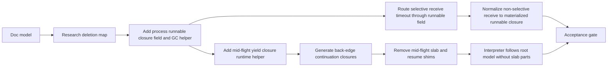

# Scheduler Zero-arg Closures Research

Ticket: fz-0k7.9.2

North-star doc: `.agent/docs/scheduler-zero-arg-closures.md`

## Thesis

The scheduler should only resume zero-argument closures.

Today, selective receive already almost has this shape: a matcher hit
materializes an outcome closure whose captures contain bound values, and the
scheduler calls a single `fz_resume(cont)` shim. Timeout also already stores an
`after_cont` closure and turns it into a pending resume when the timer fires.

The mid-flight back-edge path is the outlier. It spills raw ABI words and
side-band kind tags into `Process`, runs GC over that synthetic root slab, then
uses generated resume shims to rebuild the callee ABI.

The elegant cut is to make mid-flight yield produce a closure too:

```text
if should_yield:
  k = closure captures(next_loop_args, continuation_state)
  fz_yield_mid_flight(k)
  return YIELD_PTR
else:
  return_call loop(next_loop_args)
```

After GC, the scheduler runs `k()`.

## Current Scheduler Resume Surfaces

`runtime/src/process.rs` currently stores several scheduler re-entry shapes:

- `parked_cont: *mut u8`
  - non-selective receive continuation, later called by `fz_resume_park(msg,
    kind, cont)`.
- `parked_matched: Option<Box<ParkRecord>>`
  - selective receive waiting state: matcher, pinned roots, clause body
    closures, optional timeout closure.
- `pending_resume_matched: Option<PendingResumeMatched>`
  - runnable closure produced by a selective receive matcher hit or timeout.
- `pending_closure_entry: *mut u8`
  - initial spawn-by-closure entry.
- `pending_main_entry: *mut u8`
  - initial spawn-by-fn entry.
- `mid_flight_fn_ptr`, `mid_flight_root_count`, `mid_flight_roots`,
  `mid_flight_root_tags`
  - bespoke back-edge yield slab and generated resume shim pointer.

The unification target is not that every field disappears in one edit. The
target is that every runnable scheduler entry is a closure:

```rust
pub runnable: Option<ClosureRef>
pub wait: Option<WaitState>
```

Blocked wait state may still be receive-specific. Runnable work should not be.

## Receive Findings

Non-selective receive:

- Codegen builds a continuation closure at `Term::Receive`.
- Runtime `fz_receive_park(cont_closure_bits)` stores it in `parked_cont`.
- Current resume path pops a message and calls `fz_resume_park(msg_raw,
  msg_kind, cont)`.

This is close, but still scheduler-argument-shaped. The closure does not fully
capture the message before scheduling. A later step can turn "message arrived"
into "materialize zero-arg runnable closure with the message captured", matching
selective receive.

Selective receive:

- Runtime `fz_receive_park_matched` stores `ParkRecord`.
- `sched::initial_scan` / sender-probe materializes an outcome closure through
  `park::materialize_outcome_closure`.
- `PendingResumeMatched { cont }` is a zero-arg closure from the scheduler's
  perspective.
- `CompiledModule::run_quantum` dispatches it through `fz_resume(cont)`.

This is the strongest existing proof of the model. The name
`pending_resume_matched` is too specific; the shape is just runnable closure.

Timeout:

- `ParkRecord` stores `after_cont`.
- `sched::fire_after_timer` moves `after_cont` into
  `PendingResumeMatched { cont: after_cont }`.
- Scheduler later dispatches through the same `fz_resume(cont)` path.

Timeout is already "a no-arg closure to schedule if the timer ticks."

## Mid-flight Findings

Current codegen path:

- `src/ir_codegen.rs` builds `native_args`.
- It also builds `native_root_sources: Vec<MidFlightRootSource>`.
- On `FZ_SHOULD_YIELD`, the slow path calls:
  - `fz_mid_flight_roots_ptr()`
  - `fz_mid_flight_root_tags_ptr()`
  - stores every live arg as `{ raw word, kind byte }`
  - calls `fz_yield_back_edge(resume_fn, count)`
- Generated `fz_mid_flight_resume_fn_*` shims reload the slab and rebuild the
  callee ABI.

Current runtime path:

- `fz_yield_back_edge` stores `mid_flight_fn_ptr` and
  `mid_flight_root_count`.
- Scheduler detects `mid_flight_fn_ptr != 0`.
- `Heap::gc_mid_flight` forwards heap roots from the raw/tag slab, mailbox,
  and map builder.
- Next quantum dispatches `mid_flight_fn_ptr`.

This can be replaced by:

- a generated back-edge continuation body with zero scheduler-visible args
- a closure allocation on the slow path
- `fz_yield_mid_flight(cont)`
- GC with `cont` as the primary root, plus mailbox/map-builder process roots
- scheduler dispatch through the same closure runner used for other runnable
  closures

## Exact Deletion Targets

Once mid-flight is closure-based, these should disappear:

- `Process::mid_flight_fn_ptr`
- `Process::mid_flight_root_count`
- `Process::mid_flight_roots`
- `Process::mid_flight_root_tags`
- `fz_mid_flight_roots_ptr`
- `fz_mid_flight_root_tags_ptr`
- `fz_yield_back_edge`
- `RuntimeRefs::mid_flight_roots_ptr_id`
- `RuntimeRefs::mid_flight_root_tags_ptr_id`
- `RuntimeRefs::yield_back_edge_id`
- `CodegenEnv::mid_flight_resume_fn_ids`
- `mid_flight_resume_fn_ids`
- `mid_flight_tail_resume_fn_ids`
- generated `fz_mid_flight_resume_fn_*` and tail sibling shims
- `MidFlightRootSource`
- `mid_flight_root_value`
- `LowerError::BackEdgeTooManyArgs`
- diagnostic code `lower/back-edge-too-many-args`
- lowering test `back_edge_too_many_args_returns_error`
- runtime slab test `mid_flight_slab_mixed_tags_forward_only_heap_roots`
- interpreter helpers `mid_flight_value`, `mid_flight_parts`,
  `from_mid_flight_parts`

`is_back_edge` stays. The compiler still needs the yield check only on loop
edges.

`FZ_SHOULD_YIELD` stays. The flag is the cheap cooperative preemption signal.

`gc_with_extra_root_slots` stays for now. It is a general Cheney helper for
primary root plus extra persistent roots.

## Rename/Fold Targets

These are not deletion targets; they are vocabulary cleanup after the shape is
working:

- `pending_resume_matched` should become a general runnable closure field.
- `PendingResumeMatched` should become `RunnableClosure` or disappear into the
  field type.
- `parked_cont` should eventually become receive wait state, not runnable work.
- `pending_closure_entry` and `pending_main_entry` should become initial
  runnable closures. `pending_main_entry` may require a generated entry closure
  that captures the main fn pointer and halt continuation.
- `fz_resume_park(msg, kind, cont)` should eventually disappear once
  non-selective receive materializes a zero-arg closure before enqueue.

## Process-root GC Shape

The closure replaces only the mid-flight argument slab. It does not replace
process-owned containers that are not captured by that closure.

Still trace:

- mailbox `ValueRoot`s
- in-flight `map_builder` roots
- selective receive parked records and timeout closure while blocked
- static/off-heap closure singletons as non-moving roots

Near-term helper shape:

```rust
gc_process_roots(primary_closure_root, mailbox, map_builder, wait_state)
```

This should collect root assembly in one place instead of duplicating logic
between park-time and mid-flight paths.

## Implementation DAG



## Proposed Tickets After Research

1. `scheduler.run.1`: introduce a general runnable closure field and dispatch
   helper while preserving current behavior.
2. `scheduler.run.2`: fold selective receive and timeout pending resumes into
   the runnable closure field.
3. `scheduler.run.3`: add `fz_yield_mid_flight(cont)` and process-root GC helper
   that treats the continuation closure as the primary root.
4. `scheduler.run.4`: generate mid-flight back-edge continuation closures and
   use them on the slow path.
5. `scheduler.run.5`: delete mid-flight slabs, pointer/tag FFI, generated resume
   shims, and the eight-argument lowering limit.
6. `scheduler.run.6`: rewrite interpreter mid-flight handling away from slab
   parts.
7. `scheduler.run.7`: normalize non-selective receive to produce a zero-arg
   runnable closure before scheduler dispatch.
8. `scheduler.run.gate`: acceptance gate proving there are no slab/shim symbols
   and all scheduler resume paths use the unified closure dispatch.

## Acceptance Signals

- `rg "fz_mid_flight_roots_ptr|fz_mid_flight_root_tags_ptr|fz_yield_back_edge"`
  returns no production code references.
- `rg "mid_flight_roots|mid_flight_root_tags|mid_flight_root_count"` returns no
  production code references.
- Generated CLIF for recursive fixtures contains no mid-flight resume shim names.
- Mid-flight GC tests still prove recursive allocation finishes correctly and
  increments GC count.
- Receive, selective receive, and timeout tests prove message-bound and
  timeout-bound continuations still run.
- `cargo fmt --all -- --check`, `cargo clippy --all-targets -- -D warnings`,
  and `cargo test --workspace` pass.

