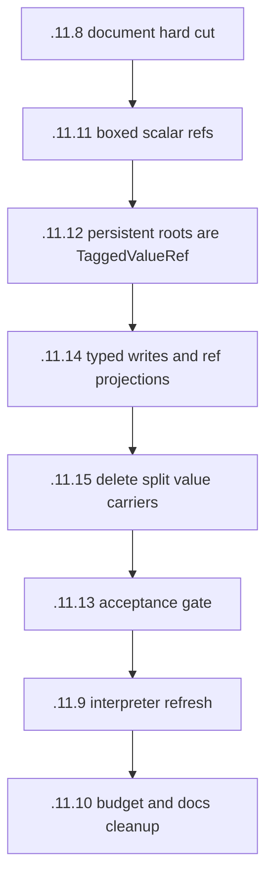

# Split Value Carrier Elimination Plan

## ELI5

There should be one dynamic value shape:

```text
TaggedValueRef
```

It is one word. Its tag says what kind of value it names. Its address points at
the payload.

For heap objects:

```text
Map ref     -> points at a map
List ref    -> points at a cons cell
Closure ref -> points at a closure
```

For scalars that must live in an `any` position and cannot be named through
existing container storage:

```text
Int ref   -> points at an i64 box
Float ref -> points at an f64 box
Atom ref  -> points at an atom-id box
```

Typed compiler lanes should still avoid boxing when they can:

```text
i64 + i64 -> i64
f64 + f64 -> f64
```

But boxing is the last resort. If a caller has an `i64` and the callee expects
an `i64`, pass the raw `i64`. If a caller has an `i64` and writes it into a map
or list, call the typed write path so the container stores the raw payload plus
its own compact metadata.

`TaggedValueRef` is the logical dynamic abstraction. Containers appear to store
`TaggedValueRef`s: dynamic reads return refs, and dynamic writes accept refs
where that is the right abstraction. That does not require every container to
physically store high-bit tagged words when a tighter local layout is obvious
and has clean projection APIs.

## What We Learned

The old split value carrier is not fundamental. It exists because current
storage splits one semantic value into two pieces:

```text
raw_payload: u64
kind tag
```

That split appears in list heads, map entries, closure captures, struct fields,
resources, mailbox roots, receive buffers, and interpreter values.

The split is exactly what makes the compiler carry pairs around, reconstruct
refs, allocate bridge helpers, and accidentally grow parallel wrappers like
`StrictValue`, `AnyValue`, `MailboxSlot`, `FzValueParts`, and friends.

If containers appear to store tagged refs, all dynamic APIs speak tagged refs,
and all typed writes stay typed, the split stops leaking into callers:

```text
old caller-visible shape: raw payload + side-band kind
new caller-visible shape: TaggedValueRef, or raw typed lanes when known
```

Object-local metadata still exists, but it describes object layout:

- map count
- struct schema id
- closure function pointer and capture count
- forwarding marker
- bitstring length
- resource stub fields

It may also compactly describe container-local payload fields, like the list
head kind packed into the cons link. That metadata is owned by the container
layout and hidden behind projection/write APIs. To callers, the container still
appears to store tagged value refs. It is not a public two-part value carrier.

## GC Model

The GC traces explicit roots and object-local layouts.

For a `TaggedValueRef`:

- scalar tags (`Int`, `Float`, `Atom`) are copied as boxed payload objects and
  have no children
- heap-object tags (`List`, `Map`, `Struct`, `Closure`, `Bitstring`,
  `ProcBin`, `Resource`) are copied and then scanned according to their layout
- sentinels (`Null`, `EmptyList`) have no children

No side table is needed. The tag and the object layout are enough.

## Target Shapes

### List

```text
old:
  head: u64
  link: next_addr | head_kind

logical API:
  fz_list_head_ref(list) -> TaggedValueRef
  fz_list_head_int(list) -> i64
  fz_list_cons_int(head: i64, tail: list_ref) -> list_ref
  fz_list_cons_ref(head: heap_or_sentinel_ref, tail: list_ref) -> list_ref
```

The compact physical layout can stay. Logically, the list appears to store a
head ref and a tail ref. The important invariant is that known scalar writes use
typed constructors. `list_cons_ref` should reject scalar refs so we do not box
just to immediately unpack into a list cell.

### Map

```text
old:
  tag_bytes: [u8]
  keys:      [u64]
  values:    [u64]

logical API:
  fz_map_get_ref(map, key) -> TaggedValueRef
  fz_map_get_int(map, key) -> i64       // panic if stored value is not Int
  fz_map_get_float(map, key) -> f64     // panic if stored value is not Float
  fz_map_get_atom(map, key) -> atom id  // panic if stored value is not Atom
  fz_map_put_int(map, key, value: i64) -> map
  fz_map_put_float(map, key, value: f64) -> map
  fz_map_put_atom(map, key, atom_id: u32) -> map
  fz_map_put_ref(map, key, value: heap_or_sentinel_ref) -> map
```

The current packed tag-byte map layout can stay while it is useful. Logically,
the map appears to store tagged value refs. Dynamic map reads can return refs to
stored scalar payload fields. Typed map reads are also fine: `map_get_int` should
project the value and panic if the stored value is not an int. Map writes should
not construct scalar refs when the input type is known. `map_put_ref` should
reject scalar refs and point callers at the typed scalar write paths.

### Struct/Tuple

```text
old:
  schema says which dynamic fields have side-band kind bytes

new:
  dynamic fields store TaggedValueRef words
  typed fields can stay raw i64/f64 when the schema proves the type
```

The schema describes layout, not a generic split value carrier.

### Closure

```text
old:
  capture_raw:  [u64]
  capture_kind: [u8]

new:
  dynamic captures: [TaggedValueRef]
  typed captures: raw typed lanes when statically known
```

This keeps continuations small without keeping a public split value carrier.

### Mailbox / Scheduler / Receive Matcher Roots

```text
old:
  split persistent root carriers

new:
  TaggedValueRef
```

The mailbox root is the message ref. Parked selective receive uses the same
shape for matcher input, pinned values, and bound outputs. Process-root GC traces
each ref by tag.

## Worklist DAG



## Acceptance Gates

- Generated code uses one-word refs at dynamic boundaries.
- Typed fast paths stay raw where the type is known.
- `rg` finds no production type or public/compiler/interpreter value carrier
  for the old split shape.
- Mailbox, parked receive state, and scheduler handoff use `TaggedValueRef`
  words where values must outlive calls; object containers may use tighter
  layout-local storage behind ref projection APIs.
- Heap read/write APIs accept and return `TaggedValueRef`.
- Heap write APIs reject scalar refs when a typed scalar write path exists.
- GC telemetry proves scalar boxes are copied but not followed as child edges.
- `dump_budgets` is green or retargeted only after inspecting the CLIF and
  explaining the new steady-state budgets.

## Stress Test

Quicksort should get smaller because list operations stop decomposing a value
into parts and rebuilding it.

The ideal dynamic path is:

```text
list_ref -> fz_list_head_ref(list_ref) -> head_ref
head_ref -> fz_ref_load_int(head_ref)   -> i64
list_ref -> fz_list_tail_ref(list_ref) -> tail_ref
```

No caller-visible two-part pair. No split value carrier in compiler/interpreter
ABI. No bridge call.

Send should be similarly direct:

```text
typed i64 -> fz_box_int_for_any(i64) -> msg_ref
fz_send_ref(pid, msg_ref)
```

Map construction does not need a persistent root story. Maps are immutable:
non-empty literals start from an empty sentinel, then each put allocates a new
map by copying the old entries and inserting/replacing the new key/value.
Typed puts pass raw scalar payloads, so construction does not box scalars just
to survive a builder. Empty maps allocate a real empty map.

`send` takes `any`, so the caller boxes only when the sent value is a known
scalar. `send` receives one `TaggedValueRef`.

- if the receiver is waiting, the scheduler gives that logical value to the
  matcher
- if the matcher captures it, the capture is materialized through the normal
  closure/container write path
- if nobody is waiting, the runtime deep-copies the tagged ref into the
  receiver heap and enqueues that copied ref

Receiving gets a ref back. Typed code projects it once, where needed.

Map writes should be direct too:

```text
known i64 value -> fz_map_put_int(map, key, value)
dynamic heap value -> fz_map_put_ref(map, key, child_map_ref)
scalar ref value -> panic; use typed scalar write path
```

Map reads can be direct when the expected type is known:

```text
known expected i64 -> fz_map_get_int(map, key) -> i64
wrong stored type  -> panic
unknown expected   -> fz_map_get_ref(map, key) -> TaggedValueRef
```

## Non-goals

- Do not preserve compatibility with split value storage.
- Do not add bridge modules.
- Do not add GC side tables.
- Do not rename the old shape and call that progress.
