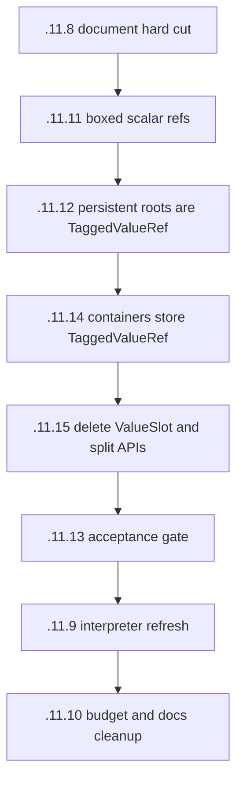

# ValueSlot Elimination Plan

## ELI5

There should be one dynamic value shape:

```text
TaggedValueRef
```

It is one word. Its tag says what kind of value it names. Its address points at
the payload.

For heap objects:

```text
Map ref     -> points at a map
List ref    -> points at a cons cell
Closure ref -> points at a closure
```

For scalars that must live in an `any` position:

```text
Int ref   -> points at an i64 box
Float ref -> points at an f64 box
Atom ref  -> points at an atom-id box
```

Typed compiler lanes should still avoid boxing when they can:

```text
i64 + i64 -> i64
f64 + f64 -> f64
```

But when a value crosses a dynamic boundary, enters a container, goes into a
mailbox, becomes a closure capture, or survives a scheduler/GC boundary, it
should be a `TaggedValueRef`.

## What We Learned

`ValueSlot` is not fundamental. It exists because current storage splits one
semantic value into two pieces:

```text
raw_payload: u64
kind: ValueKind
```

That split appears in list heads, map entries, closure captures, struct fields,
resources, mailbox roots, receive buffers, and interpreter values.

The split is exactly what makes the compiler carry pairs around, reconstruct
refs, allocate bridge helpers, and accidentally grow parallel wrappers like
`StrictValue`, `AnyValue`, `MailboxSlot`, `FzValueParts`, and friends.

If all stored dynamic values are tagged refs, the split disappears:

```text
old: raw payload + side-band kind
new: TaggedValueRef word
```

Object-local metadata still exists, but it describes object layout:

- map count
- struct schema id
- closure function pointer and capture count
- forwarding marker
- bitstring length
- resource stub fields

It does not describe "what kind of value is in this separate raw word" because
the value word already says that.

## GC Model

The GC traces explicit roots and object-local layouts.

For a `TaggedValueRef`:

- scalar tags (`Int`, `Float`, `Atom`) are copied as boxed payload objects and
  have no children
- heap-object tags (`List`, `Map`, `Struct`, `Closure`, `Bitstring`,
  `ProcBin`, `Resource`) are copied and then scanned according to their layout
- sentinels (`Null`, `EmptyList`) have no children

No side table is needed. The tag and the object layout are enough.

## Target Shapes

### List

```text
old:
  head: u64
  link: next_addr | head_kind

new:
  head_ref: TaggedValueRef
  tail_ref: TaggedValueRef  // EmptyList or List
```

The head is already self-describing. The tail is already a list-ish ref.

### Map

```text
old:
  tag_bytes: [u8]
  keys:      [u64]
  values:    [u64]

new:
  keys:   [TaggedValueRef]
  values: [TaggedValueRef]
```

The map no longer needs tag bytes for values. If ordering or hashing needs type
knowledge, it reads the tag from each ref.

### Struct/Tuple

```text
old:
  schema says which fields are ValueSlot and where side-band kind bytes live

new:
  dynamic fields store TaggedValueRef words
  typed fields can stay raw i64/f64 when the schema proves the type
```

The schema describes layout, not a generic split value carrier.

### Closure

```text
old:
  capture_raw:  [u64]
  capture_kind: [u8]

new:
  dynamic captures: [TaggedValueRef]
  typed captures: raw typed lanes when statically known
```

This keeps continuations small without keeping `ValueSlot`.

### Mailbox / Scheduler Roots

```text
old:
  ValueRoot { value: u64, kind: u8 }

new:
  TaggedValueRef
```

The mailbox root is the message ref. Process-root GC traces each ref by tag.

## Worklist DAG



## Acceptance Gates

- Generated code uses one-word refs at dynamic boundaries.
- Typed fast paths stay raw where the type is known.
- `rg "ValueSlot|ValueRoot"` finds no production type or public/compiler/
  interpreter value carrier.
- Mailbox, map builder, parked receive state, and scheduler handoff store
  `TaggedValueRef` words.
- Heap read/write APIs accept and return `TaggedValueRef`.
- GC telemetry proves scalar boxes are copied but not followed as child edges.
- `dump_budgets` is green or retargeted only after inspecting the CLIF and
  explaining the new steady-state budgets.

## Stress Test

Quicksort should get smaller because list operations stop decomposing a value
into parts and rebuilding it.

The ideal dynamic path is:

```text
list_ref -> fz_list_head_ref(list_ref) -> head_ref
head_ref -> fz_ref_load_int(head_ref)   -> i64
list_ref -> fz_list_tail_ref(list_ref) -> tail_ref
```

No `{word, kind}` pair. No `ValueSlot`. No bridge call.

Send should be similarly direct:

```text
typed i64 -> fz_alloc_int_ref(i64) -> msg_ref
fz_send_ref(pid, msg_ref)
```

Receiving gets a ref back. Typed code projects it once, where needed.

## Non-goals

- Do not preserve compatibility with split value storage.
- Do not add bridge modules.
- Do not add GC side tables.
- Do not rename the old shape and call that progress.
