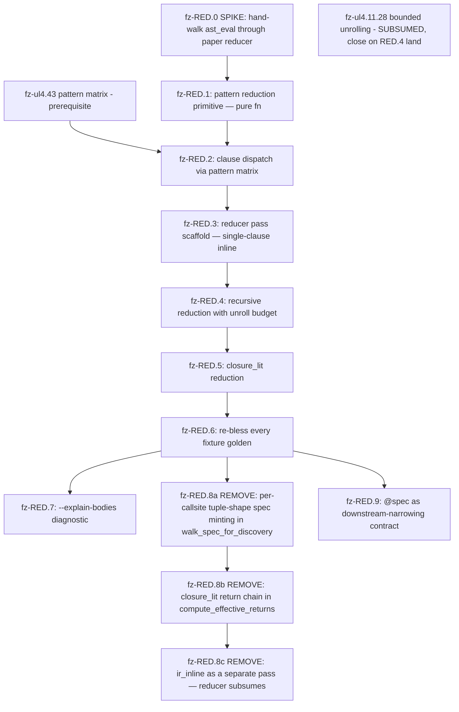

# Bodies, Boundaries, and Reuse — Design Note

Status: **design discussion**, pre-implementation. A teachable picture of
how fz should decide what to compile, and how the compiled code should
allocate. Not yet tied to tickets.

## The puzzle

Here is the entire `ast_eval` fixture (`fixtures/ast_eval/input.fz`):

```
fn eval({:num, n}), do: n
fn eval({:add, a, b}), do: eval(a) + eval(b)
fn eval({:mul, a, b}), do: eval(a) * eval(b)

fn main() do
  print(eval({:num, 42}))
  print(eval({:add, {:num, 2}, {:mul, {:num, 3}, {:num, 4}}}))
  print(eval({:mul, {:add, {:num, 1}, {:num, 2}}, {:add, {:num, 3}, {:num, 4}}}))
end
```

Nine lines. Prints `42`, `14`, `21`.

Today this produces **13 specializations of `eval`**, more for each
helper, a cascade of CPS continuations, and **~1400 lines of CLIF** —
for a program whose entire output is three integers. Every recursive
call inside `eval` is also allocating cons cells, struct slots, and
closure objects on the heap, most of which the runtime then traces and
reclaims.

Two questions worth answering for fz:

1. **What should the compiler compile?**
2. **For the code it does compile, how should it allocate?**

Today fz answers both questions by accident — compile every shape we
see at every callsite, allocate fresh memory for every constructor.
This note proposes principled answers to both, drawing on 50 years of
lore.

The two answers compose: when the first cuts the right amount, the
second has much less to do; when the first stops at a boundary, the
second decides how the boundary code mutates rather than allocates.

---

# Part 1: What gets compiled

## Functions are templates, not specs

Look at clause 1:

```
fn eval({:num, n}), do: n
```

This isn't a function from "some type" to "some type." It's a
**rewrite rule**: whenever you see `eval({:num, N})`, replace it with
`N`. Whatever `N` was — `42`, `1.5`, `:hello` — that's what comes out.

Clause 2 is the same shape:

```
fn eval({:add, a, b}), do: eval(a) + eval(b)
```

`eval({:add, X, Y})` rewrites to `eval(X) + eval(Y)`.

Every fz function is a stack of rewrite rules. The compiler's job is
to **apply the rewrites until it can't**.

For ast_eval:

```
eval({:add, {:num, 2}, {:mul, {:num, 3}, {:num, 4}}})
  ⇒ eval({:num, 2}) + eval({:mul, {:num, 3}, {:num, 4}})     (clause 2)
  ⇒ 2 + eval({:mul, {:num, 3}, {:num, 4}})                   (clause 1)
  ⇒ 2 + (eval({:num, 3}) * eval({:num, 4}))                  (clause 3)
  ⇒ 2 + (3 * 4)
  ⇒ 14
```

That whole chain happens **at compile time**, on the source program.
The output is `14`. No `eval` body need exist.

Apply this to all three callsites in `main` and we have:

```
fn main() do print(42); print(14); print(21) end
```

**Zero `eval` bodies.** Three `print` calls with literal arguments.
This technique has a name: **partial evaluation** (Futamura 1971;
Jones, Gomard, Sestoft 1993). It's been in the lore for fifty years.

## Where reduction stops

Reduction has limits. When it stops, the compiler emits a real body —
the version of the function that performs the work at runtime. We
call this a **boundary body**, because the boundary is between what
the compiler can know and what the runtime must decide.

Reduction stops when *any* of these is true:

### 1. The value's shape is opaque

```
fn main() do
  msg = receive()
  print(eval(msg))
end
```

`msg` is whatever an external process sent us. The compiler can't pick
a clause, can't substitute, can't fold. Boundary.

### 2. The unroll budget is exceeded

```
fn count(0, acc), do: acc
fn count(n, acc), do: count(n - 1, acc + 1)
fn main() do print(count(100000, 0)) end
```

In principle, `count(100000, 0)` reduces in 100,000 small steps. In
practice nobody wants 100,000 unrolled cons cells of CLIF. The
compiler picks a budget (say 32 steps) and stops when hit. A single
`count` body is emitted; `main` calls it once with `(100000, 0)`.

That's a **cost-model knob**, with a sane default.

### 3. Recursion without provable structural decrease

If reducing `f(x)` requires reducing `f(g(x))` and `g(x)` isn't
provably smaller than `x` in any measure the compiler tracks: stop.
Boundary. Avoids infinite expansion.

## How closures and spawn fit in

Closures are values that carry a function and zero or more captured
variables. They reduce normally:

**Static captures.** `add_to(10, 20)` produces a closure with captures
`[10, 20]` — literals. Inline the captures into the body: it becomes
`10 + 20 + z`. When called with `12`: `42`. **No closure heap object
is allocated at runtime.** The captures dissolved into literals; the
call dissolved into arithmetic.

**Opaque captures.** `parent(some_runtime_value)` produces a closure
whose captures aren't statically known. The closure must be
heap-allocated; the lambda body parameterizes over `tag`. Boundary
body for the lambda.

`spawn` is the same machinery. `spawn(fn () -> child(42))` reduces the
lambda body in isolation (`child(42)` → `send(1, 42)`) and the runtime
spawns a static thunk. `spawn(fn () -> send(1, tag))` where `tag` is
opaque keeps the closure on the heap.

## Polymorphic library functions

The interesting case — a function exported for general use, called
from many places.

```
defmodule L do
  fn map(_, []), do: []
  fn map(f, [h | t]), do: [f(h) | map(f, t)]
end

fn user_a() do L.map(fn(x) -> x * 2, [1, 2, 3]) end
fn user_b(lst) do L.map(fn(x) -> x + 1, lst) end   # lst opaque
fn user_c(f, ys) do L.map(f, ys) end               # both opaque
```

- **user_a:** both args static. Full reduction → `[2, 4, 6]` as a
  constant. **Zero `map` bodies.**
- **user_b:** `f` static, `lst` opaque. Reduction stops at the call.
  **One specialized `map` body** with `+1` inlined into the loop. No
  `f` parameter.
- **user_c:** both opaque. **One polymorphic `map` body** with `f` as
  a parameter, invoked through a closure call per cell.

Total `map` bodies: **2**. One per equivalence class of *boundary
stops*, not one per callsite.

## What today's pipeline already does, partially

Several existing passes are doing pieces of this:

- `ir_inline` — non-recursive inlining (leaf-up pass).
- `ir_fold` — constant folding post-inline.
- `ir_dce` — dead code cleanup.
- `ir_fuse` — block fusion.
- `ir_typer`'s `narrow_for_cond` — pattern-vs-Descr narrowing.
- `closure_lit` — function identity through values.
- `fn_constants` — known-function propagation.

A coherent reducer pass would absorb these into one driver: walk from
program roots, reduce at each callsite, emit boundary bodies where
reduction stops. The current per-callsite spec-fanout shrinks
dramatically.

## Scope of analysis

Reduction is driven from **program roots**: `main`, every function
passed to `spawn`, and any function exported as a runtime entry point.
From each root the reducer walks the call graph; at each callsite it
reduces; results are memoized by `(fn_id, input_descrs)`. The memo
table is structurally today's spec table — but used as a cache for
reduction results, not as a registry of bodies to emit.

Bodies are emitted only at stops, not per public function. Public-vs-
private doesn't change the analysis; it changes what's reachable.

Whole-program compilation (one source tree, one `main`) is what fz
does today and what this design assumes. Separate compilation is a
larger change that's compatible in principle — libraries would ship
reducible IR plus types, and a final-link pass would specialize — but
it's out of scope here.

---

# Part 2: How the compiled code allocates

Reduction handles "should this code exist." But for the boundary
bodies that do exist, there's a separate question: when they
construct a cons cell, a tuple, a closure — does the runtime allocate
fresh memory, or can it reuse memory it was already going to free?

This question is largely orthogonal to reduction. The lore for it is
**Perceus**: precise reference counting with reuse analysis (Reinking,
Xie, de Moura, Leijen, ICFP 2021). Lean 4 and Koka use it in
production. Pure functional code over linked lists, trees, and structs
compiles to in-place updates without changing the source.

## The shape of the win

Take user_b's specialized `map` body:

```
fn map_specialized_for_user_b([]), do: []
fn map_specialized_for_user_b([h | t]), do: [h + 1 | map_specialized_for_user_b(t)]
```

Naive implementation: at every cons cell of the input, allocate a
fresh cons cell for the output. For an N-element list that's N
allocations on the way down (and N decrefs / GC traces on the way out).

With reuse analysis: at each step, the compiler observes that the
input cons cell is **about to be dropped** (its refcount reaches zero
right after we read `h` and `t`). Instead of freeing it and allocating
a fresh cell, **mutate the head slot in place** and reuse the cell as
the output. Same machine code shape as a hand-written destructive
loop. Same source as a pure functional definition.

This is the offer. It's the same offer Lean 4 makes today.

## How it composes with CPS

fz's IR is in CPS form: every `Term::Call` carries an explicit
`Cont { fn_id, captured }`. The cont's slot 0 *is* the destination for
the call's result. That's already half of **destination-passing style**:
the compiler always knows where the result of any call goes next.

Reuse analysis extends this: the cont can carry not just "where to put
the result" but "into which pre-allocated slot of which structure."
The producer writes directly into the destination. CPS makes this
information first-class in the IR — fz doesn't have to invent a new
calling convention to express it.

This generalizes what fz already does at `Term::TailCall`: when callee
and caller share frame shape, the frame is reused in place. Reuse
analysis applies the same idea to heap-allocated values, not just
stack frames.

## When is it safe?

Reuse is safe when the value being mutated is **unique** — no other
reference exists or will exist to it. Three traditions for proving
uniqueness:

- **Linear types** (Linear Haskell, Granule). The user declares
  linearity in types; the compiler checks. Most precise, most user
  burden.
- **Uniqueness types** (Clean, Mercury, Idris 2's `*`). The compiler
  infers from usage patterns; types carry a `*` qualifier.
- **Reference counting + reuse analysis** (Perceus, in Lean 4 and
  Koka). The compiler tracks refcounts at compile time; when it can
  prove RC=1 at a drop site, it rewrites to in-place mutation.
  Automatic, no user annotation.

**Perceus-style reuse analysis is the right fit for fz.** It's
automatic (no source change), composes with reduction without coupling
to it, and is validated in production. fz's set-theoretic Descrs give
it sharper handles than plain RC — uniqueness can be carried as a
property in the type lattice when it matters.

## What this does for the example programs

For the fully-reduced cases (ast_eval, fib_tailrec, list_primitives on
static lists, the closures-with-literal-captures cases), reuse
analysis has nothing to do. **The allocations were already dissolved
by reduction.** Reduction is the cheapest possible optimization for
allocation: don't have any.

For boundary bodies, reuse analysis pays:

- `map_specialized_for_user_b` over an opaque list: **zero
  allocations per step** if the list is unique (it usually is, fresh
  from the caller). In-place mutation; same code as a destructive
  loop.
- `count` over runtime integers: no heap allocations to optimize
  (everything is unboxed); reuse analysis has nothing to do.
- The receive boundary in `relay`: if the received message is unique
  (it is, fresh from the mailbox), `msg + 1` can write into wherever
  the result is destined without intermediate boxing.
- Closures with opaque captures: the closure heap object is fresh and
  unique; downstream code that reads its captures and produces a
  same-shape value can reuse the same memory.

The combined picture: **almost no runtime allocations survive the
combination of reduction and reuse.** The ones that do are the ones
that *have to* — genuinely shared data, GC-traced structures with
multiple live references, mailbox messages with multiple readers.

---

# Part 3: How the two compose

The pipeline:

1. **Reduce** from program roots. Static callsites collapse to
   constants; boundary bodies emerge with explicit Descrs.
2. **Linearity analyze** the boundary bodies. Mark each allocation
   site as unique or shared. fz's Descrs help here: set-theoretic
   types can carry uniqueness as a property.
3. **Reuse-rewrite.** Where producer-allocations and consumer-drops
   match shape and uniqueness, rewrite to in-place mutation. The
   cont's destination slot becomes a write target rather than a fresh
   alloc.
4. **Codegen.** Emit the now-rewritten bodies.

Each pass is local:

- Reduction doesn't need to know about linearity.
- Linearity doesn't need to know about reduction's choices.
- Reuse-rewrite doesn't add new shapes; it just turns
  alloc-then-write into write-through-pointer.

The interaction that matters: **reduction shrinks the surface area
that linearity has to be precise about.** A reduced program has fewer
allocation sites, and the ones it has tend to be in tight loops where
reuse wins are largest. Each pass makes the next pass's job easier.

---

# The user contract

Two predicates the user can keep in their head and reason about their
code's compiled shape from:

> **Number of bodies = number of opacity boundaries (after
> annotations).**

> **Number of allocations = number of (boundary-body × non-unique
> values) (after reuse analysis).**

Both are responsive to user input:

- **Annotations narrow opacity.** `@spec` on functions, typed receive,
  typed externs. Each is a firewall: code without annotations flows
  in whatever type inference can prove; code with annotations treats
  the annotation as ground truth downstream callers can rely on.
- **Sharing controls reuse.** Code that doesn't share values gets
  in-place mutation for free. Code that does share allocates;
  reference-counting paths apply.

Programs with no opacity and no sharing reduce to constants and
allocate nothing. Programs with both produce a body per boundary, an
allocation per shared value. **All of this is mechanically derivable
from source — no surprises, no per-program tuning.**

This is the user-facing offer:

- BEAM can't make it (no specialization, polymorphic everywhere).
- Erlang's dialyzer can't make it (under-approximate types, no
  specialization).
- Haskell-with-stream-fusion can make it for some idioms but requires
  user pragmas and rewrite rules.
- Lean 4 makes the allocation half (Perceus) cleanly.
- **fz can make both halves cleanly**, because the IR is already CPS,
  the type lattice is set-theoretic, and the closed-world assumption
  holds.

---

# Knobs

## Three the user gets

1. **`@spec` on functions.** A contract: "this function returns `T`."
   The compiler verifies the body satisfies it; downstream callers
   treat it as ground truth.
2. **Typed receive / typed mailbox.** "This process accepts messages
   of type `T`." Sends are type-checked; receives produce values of
   type `T` rather than `any`.
3. **Typed externs / FFI.** Same idea at the language boundary.

All three are firewalls that stop opacity (and therefore boundary
bodies) from propagating.

## Two the compiler gets

1. **Unroll budget.** Maximum reduction steps at a single callsite
   before emitting a body call. Default around 32. Caps explosion on
   large literal inputs.
2. **Inline budget.** When `f` is statically known but inlining it
   would produce a large body, prefer to emit a closure invocation.
   Mostly a future concern; default "always inline known `f`" works
   for current fz programs.

Both have sane defaults. Most programs never touch them.

## A possible fourth knob

Uniqueness annotations / hints (`@unique`, `@shared`) for cases where
the compiler can't infer linearity but the user knows the answer.
Probably optional, probably rare. Listed here only so the design
admits it.

---

# Where reduction stops, mechanically

A bullet list of the stop conditions, for reference:

- **Argument value is opaque** — Descr too wide to dispatch a clause.
- **Recursive call where structural decrease cannot be proven** —
  avoids infinite expansion.
- **Recursive call where structural decrease *is* provable but the
  unroll budget is exceeded** — cost-model cap.
- **`receive`** — always; output is the mailbox type (`any` if
  untyped).
- **Extern / FFI call** — output is declared, or `any` if undeclared.
- **Spawn of a value-flow closure where the captures aren't all
  static** — opaque-capture spawn emits a body; static-capture spawn
  reduces.

Everything else: the reducer continues, applying pattern dispatch,
substitution, arithmetic constant folding, and recursive reduction.

---

# What success looks like

For each fixture, a predicted shape — *body count* (user functions
only; `main` and externs are always emitted) and *allocation
character* (whether boundary-body allocations survive reuse analysis):

| Fixture | Bodies | Allocations |
|---|---|---|
| `polymorphic` | 0 | none |
| `higher_order` | 0 | none |
| `closure_typed_captures` | 0 | none (static captures dissolve) |
| `curried_add` | 0 | none |
| `ast_eval` (static AST) | 0 | none (full reduction) |
| `mutual_recursion(10)` | 0 | none |
| `fib_tailrec(20)` | 0 | none |
| `list_primitives` (static list) | 0 | none |
| `tail_recursion` (`count(100000, 0)`) | 1 | none (int loop, unboxed) |
| `concurrency_ping_pong` | 1 | message in mailbox (shared) |
| `relay` (untyped) | 1 | message + arithmetic box |
| `relay` (typed `int`) | 1 | none (unboxed int through) |
| `L.map(static_f, opaque_list)` | 1 | reuse cons cells in place |
| `L.map(opaque_f, opaque_list)` | 1 | reuse cons cells in place; closure dispatch per cell |

The CLIF for `ast_eval` drops from ~1400 lines to under 100. The
allocation count for any reduced program is zero. The boundary cases
match what a hand-tuned destructive implementation would produce.

These are **reviewable predictions, not numeric ones.** An agent
reading the generated CLIF and the per-fixture entry above can assess
whether the output is "reasonable for the source program" — the bar
the user can keep in their head.

---

# Prior art

The technique has 50 years of lore behind it.

## Part 1 (reduction)

- **Partial evaluation (PE).** Yoshihiko Futamura, 1971. The Futamura
  projections. Jones, Gomard, Sestoft's textbook *Partial Evaluation
  and Automatic Program Generation* (1993) is the canonical reference;
  free online.
- **Supercompilation.** Valentin Turchin, 1980s. PE pushed harder;
  drives reduction through branches.
- **Stalin** (Jeffrey Mark Siskind, 1990s, Scheme). Whole-program flow
  analysis + closure elimination. Close cousin to what we're
  describing.
- **MLton** (SML). Whole-program defunctionalization + per-call
  monomorphization. Production-grade example of aggressive
  specialization paying off on idiomatic functional code.
- **GHC's simplifier + specializer + stream fusion.** Less aggressive
  than Stalin / MLton; driven by `INLINE` / `SPECIALIZE` pragmas plus
  rewrite rules. The `list_primitives` payoff is what GHC's stream
  fusion delivers in production.
- **Truffle / Graal** (JVM). First Futamura projection applied at
  runtime: PE over an AST interpreter as a JIT strategy.

## Part 2 (reuse)

- **Perceus** (Reinking, Xie, de Moura, Leijen, ICFP 2021). Precise
  reference counting with compile-time reuse analysis. The seminal
  paper. Implemented in Lean 4 and Koka.
- **Linear Haskell** (Bernardy et al., POPL 2018). Linear types as a
  language extension for in-place updates.
- **Clean / Mercury** uniqueness types. Earlier (1990s) tradition of
  type-system-tracked uniqueness for in-place mutation.
- **Granule** (Orchard et al.). Modern research on graded modal types
  for resource-aware programming.
- **Destination-passing style** (DPS) as a compilation technique
  appears in several systems; see Shaikhha et al.'s work on
  DPS as a functional intermediate language for numerical code.

## What's specifically less well-trodden

- **Combining set-theoretic types (CDuce / modern Elixir) with PE-style
  specialization** to drive both. Set-theoretic types have a rich
  type-checking literature; using them as the binding-time lattice
  for a PE is not standard.
- **Combining whole-program PE with Perceus-style reuse.** Lean 4
  has Perceus but not aggressive PE; Stalin/MLton have aggressive PE
  but no reuse analysis. The combination is the prize.
- **Typed mailboxes as a PE input.** Erlang punts; Pony / Akka Typed
  have typed mailboxes but no aggressive specialization. The
  combination is the prize.
- **The user-facing contract.** "Body count = opacity boundaries;
  allocation count = boundary × non-unique" as teachable properties.
  Most existing systems do something like this but don't expose it
  as a property the user can reason about.

fz is a recognizable point in the design space — every individual
ingredient is published and validated. The combination, with this
user-facing contract, is novel as a coherent package.

---

# Status

This document captures **design intent** as agreed in discussion.
Part 2 (allocations / reuse) has its own in-flight epic in `fz-q9g`;
we defer to it. This section nails down Part 1 (reduction) into an
atomic ticket DAG with explicit removals.

## What we know about the existing pipeline

After researching the codebase, the relevant existing work is:

- **fz-ul4.40 (closed)** introduced a payoff predicate that drops
  narrowings whose Descr change is a no-op for codegen (ABI, TypeTest
  fold, fast-path eligibility). This is partial — it can't reduce
  *across* calls; ast_eval still ships 13 `eval` specs after .40.
- **fz-ul4.41 (closed)** fixed recursive return Descrs.
- **fz-ul4.42 (closed)** added `reachable_specs` BFS to skip emitting
  unreachable specs.
- **fz-ul4.43 (in flight)** unifies pattern matching into a single
  matrix compiler. This is the **load-bearing dependency** for the
  reducer — clause dispatch goes through the matrix.
- **fz-ul4.31 (closed)** implemented `@spec` parsing + validation
  (`spec_check::validate_specs`). The contract surface exists; what's
  missing is "downstream callers see declared return as ground truth."
- **fz-ul4.11.28 (open, speculative)** was bounded recursion unrolling
  as a standalone idea. It gets **subsumed** by the reducer's
  budget-bounded reduction.
- **`ir_inline`, `ir_fold`, `ir_dce`, `ir_fuse`** each do pieces of
  what a unified reducer would do. We keep them; the reducer is a
  new pass that subsumes their sequencing logic and adds
  cross-callsite structural reduction.
- **The interp walks `Module` directly with no spec dependency.** This
  is decisive: a Module-level reducer pass preserves three-path parity
  by construction — interp consumes the same reduced IR codegen sees.

## The architectural refinement

After research, the cleanest shape is:

> **The reducer is a `Module → Module` pass** in the existing pipeline.
> It plugs in before the typer. The typer sees a smaller call graph;
> existing payoff-gating + reachable-spec pruning then handle the
> residual without further changes.

This is much simpler than "rewire the typer's discovery walk." It's a
single new pass; existing machinery (inline, fold, dce, fuse, typer,
codegen) continues to compose. Three-path parity falls out for free.

## Reducer policy: all-or-nothing per callsite

The reducer attempts each top-level callsite in a scratch buffer.
Either reduction terminates within budget (commit) or it doesn't
(discard the partial unrolling, leave the original call). No partial
commits — this keeps the residual IR predictable and the diagnostic
honest. `count(100000, 0)` therefore stays a single call to a single
body, not a 32-step prefix plus a tail.

## The ticket DAG



## Each ticket, ELI5

### fz-RED.0 — SPIKE: hand-walk ast_eval through a paper reducer

**Goal:** Verify the algorithm before any code lands. Walk each `eval`
call in main through the reducer rules by hand (pattern dispatch,
substitute, recurse on subtrees, fold arithmetic). Confirm we land at
`42`, `14`, `21`.

**What lands:** A test file (or markdown) recording the walk step by
step. No production code.

**Stop condition for the arc:** If the walk hits a step that requires
a judgment call we haven't named, that's the hopeless issue. We stop
the arc here and re-design.

**Removals:** None.

---

### fz-RED.1 — Pattern reduction primitive

**Goal:** A pure function that, given a `Prim` whose inputs are all
literal Descrs, returns the literal Descr of its output. Plain
constant folding, exposed as a reusable primitive. `ir_fold` already
does the equivalent for blocks; we extract its core into a callable
shape.

**What lands:** `crate::reducer::fold_prim(prim, env) -> Option<Const>`
or similar. Tests in isolation.

**Removals:** None yet; `ir_fold` keeps its block-level driver.

---

### fz-RED.2 — Clause dispatch via the pattern matrix

**Goal:** Given a multi-clause `FnIr` and an input Descr, select the
clause whose pattern matches, or return `Stop` if the Descr is too
wide to dispatch statically. Uses the pattern matrix from fz-ul4.43.

**What lands:** `crate::reducer::dispatch(fn, input_descr) -> Dispatch`
where `Dispatch = MatchedClause(idx, bindings) | StopOpaque`. Tests on
ast_eval clauses, list_primitives, mutual_recursion.

**Removals:** None.

**Depends on:** fz-ul4.43 landing first (the matrix is the dispatcher).

---

### fz-RED.3 — Reducer pass scaffold

**Goal:** A new `ir_reducer` pass that walks the Module from roots
(main + spawned fns), tries to reduce each callsite, and replaces
calls with their reduced bodies *only* when the callee is a single
non-recursive clause and the call's inputs are statically known.
Pipeline integration: runs after `ir_inline`, before the typer.

**What lands:** `crate::ir_reducer::reduce_module(&mut Module)`. Tests:
polymorphic (0 `id` bodies), higher_order with `apply2(double, 21)`
(0 user bodies), closure_typed_captures, curried_add.

**Removals:** None yet. `ir_inline` still runs.

---

### fz-RED.4 — Recursive reduction with unroll budget

**Goal:** Extend the reducer to descend into recursive calls. Tracks
an unroll counter (default 32). All-or-nothing per top-level callsite:
if recursion terminates within budget, commit; otherwise discard the
partial work and leave the original call in place.

**What lands:** Recursion logic in `ir_reducer`. A config knob
`UNROLL_BUDGET` (default 32, override via env or attribute later).
Tests: ast_eval reduces to constants, fib_tailrec(20) reduces,
mutual_recursion reduces, list_primitives reduces, `count(100000, 0)`
stays a call.

**Removals:** `fz-ul4.11.28` (bounded recursion unrolling) is now
subsumed; close it on this ticket's land with a link.

---

### fz-RED.5 — Closure_lit reduction

**Goal:** When `f := closure_lit(F, [captures])` and the captures
reduce to literals, inline F's body with captures substituted. Uses
the existing `closure_lit` Descr machinery.

**What lands:** Closure-reduction logic in `ir_reducer`. Tests:
spawn2_basic and spawn_with_captures with literal captures reduce
the closure away; opaque-capture forms keep the closure.

**Removals:** None yet.

---

### fz-RED.6 — Re-bless every fixture golden

**Goal:** Update `expected.clif` and `expected.specs` across every
fixture to reflect the reduced IR. Verify runtime output unchanged.
Per-fixture review: each diff should be reviewable as "this output is
reasonable for this source." This is the agent-review checkpoint the
design promises in lieu of a numeric predictor.

**What lands:** Updated golden files; CI green.

**Removals:** None.

---

### fz-RED.7 — `--explain-bodies` diagnostic

**Goal:** A diagnostic mode that prints, for each user function, the
number of bodies emitted and the source location of the boundary that
forced each. User-facing pedagogy; makes the contract teachable.

**What lands:** `fz dump --emit bodies` (or similar). Per-fixture
golden output.

**Removals:** None.

---

### fz-RED.8a — REMOVE: per-callsite tuple-shape spec minting

**Goal:** The reducer has already eliminated the calls that would have
forced per-tuple-shape specs to be minted. The discovery walk in
`walk_spec_for_discovery` can be simplified: specs come only from
calls that survived reduction. Delete the per-tuple-shape narrowing
loop that's now dead.

**What lands:** Reduced surface area in `ir_typer.rs`. Tests still
green; goldens unchanged from RED.6.

**Removals:** Several hundred lines in the typer's discovery walk.

---

### fz-RED.8b — REMOVE: closure_lit return chain in `compute_effective_returns`

**Goal:** Once the reducer has propagated closure_lit returns at
compile time, the typer's runtime LFP no longer needs the
closure_lit-driven return chain. Delete the closure_lit branches in
`compute_effective_returns` and the `resolve_closure_return` helper.

**What lands:** Reduced LFP code in `ir_typer.rs`. Goldens unchanged.

**Removals:** ~50-100 lines of LFP cont-key cascade.

---

### fz-RED.8c — REMOVE: `ir_inline` as a separate pass

**Goal:** The reducer subsumes non-recursive inlining (it inlines any
known-body, statically-known-input call). `ir_inline` and
`inline_single_use_conts` become redundant. Delete them; the reducer
handles all inlining.

**What lands:** `ir_inline.rs` deleted (or stub). Pipeline simpler.
Goldens unchanged (the reducer was already doing this work).

**Removals:** ~1400 lines of `ir_inline.rs` + the related call sites.

---

### fz-RED.9 — `@spec` as downstream-narrowing contract

**Goal:** When a function has a declared `@spec`, callers infer its
return as the declared Descr (not by walking the body). The reducer
treats `@spec`'d functions as boundaries by default — the user opted
into emitting a body for it.

**What lands:** Typer change: callsite return Descr query consults
declared `@spec` first. Reducer change: stop at `@spec`'d calls
unless they're trivially inlinable. Tests: a fixture demonstrating
that `@spec` narrows downstream inference.

**Removals:** None.

**Depends on:** RED.6 stable (existing fixtures unchanged).

## The walkthrough — surfacing issues

### Issue 1: pattern matrix dependency

RED.2 depends on `fz-ul4.43` (pattern compiler matrix). The matrix is
in-flight as `[in_progress]`. RED.0 and RED.1 can proceed in parallel
to .43; RED.2 waits.

**Resolution:** Sequencing is explicit in the DAG. No blocker that
isn't already tracked.

### Issue 2: `effective_return_for` query — needed or not?

The original doc proposed `effective_return_for(fn, input_descrs)` as
the load-bearing prototype. After the Module-transformation refinement,
**we don't need it as a separate query**. The reducer reduces the call
to a literal IR expression; the literal *is* the answer. For calls
that don't fully reduce, the typer handles return Descrs as it does
today on the residual.

**Resolution:** Drop the `effective_return_for` framing. RED.0 (the
spike) verifies the reducer rules on paper; that's the load-bearing
check.

### Issue 3: all-or-nothing reduction could surprise

If a callsite *almost* fits in budget but blows it at the last step,
the user gets a body call instead of the unrolled code they might have
expected. Fix: the diagnostic (RED.7) shows which callsites hit the
budget — the user can raise `UNROLL_BUDGET` for the file or fn if they
want more unrolling.

**Resolution:** Visibility, not policy. The default is conservative;
the user has a knob.

### Issue 4: closure with mixed static/opaque captures

`fn(x) -> static_val + opaque_capture + x` — one capture literal, one
opaque. Can we partially reduce? Yes — substitute the literal capture,
leave the opaque one as a parameter. The reduced body is "smaller" but
not fully gone. Adds one new shape to the closure heap object: the
opaque-captures-only form.

**Resolution:** Reducer handles partial closure capture substitution
naturally. Tests in RED.5 cover the mixed case.

### Issue 5: receive with downstream call

`receive { msg -> eval(msg) }` — `msg :: any`. The reducer stops at
`eval(msg)` because the input is opaque. `eval` gets a body, callable
with any AST union. main's static calls to `eval(...)` still reduce
fully because they're separate callsites with known inputs.

**Resolution:** The "two universes" property holds. Static callers
get reduced code; opaque callers get a body. Same fn, different
treatment by callsite — exactly the design contract.

### Issue 6: spec_check (the `@spec` validator) currently walks specs

`validate_specs` checks `inferred ⊆ declared` across the typer's
spec set. With fewer specs after reduction, this check operates on a
smaller surface. Should keep working without change — the residual
specs still need to satisfy declared bounds.

**Resolution:** No change needed. Verify in RED.6 that
`spec_ok` fixture and `spec_check` tests pass.

### Issue 7: removals could cascade

RED.8a, .8b, .8c remove machinery that the rest of the codebase
references. Each is its own atomic step with its own test verification.
Order matters: .8a first (removes the now-dead walk code), then .8b
(removes the now-dead LFP code), then .8c (removes ir_inline once both
typer simplifications are stable).

**Resolution:** Sequenced in the DAG.

### Issue 8: AOT path

AOT compiles the same Module as JIT (per the `cps-in-clif.md` and
existing `compile_with_backend` design). The reducer pass runs once;
both backends consume the reduced Module. Three-path parity (interp +
JIT + AOT) is preserved by construction.

**Resolution:** Verified by inspection of the existing pipeline.

## Acceptance for the whole arc

- **ast_eval CLIF drops from ~1400 lines to under 100.**
- **ast_eval spec count drops from 50+ to ≤ 3.**
- **All existing fixtures pass three-path parity** (interp + JIT + AOT
  agree on output).
- **`fz dump --emit bodies` produces correct attributions** on each
  fixture in the table above.
- **Removed code is gone** — not stubbed, not commented out. The
  reducer subsumes what it replaces.

## What we explicitly defer

- **Typed receive** (depends on `fz-ul4.19` processes work).
- **Send-site mailbox-type check** (depends on typed receive).
- **All of Part 2** (allocations / reuse / DPS) — `fz-q9g` handles it.
- **Cross-module inlining** (`fz-ul4.11.27`) — orthogonal.
- **`@no_inline`** (`fz-ul4.11.26`) — orthogonal; can defer until a
  hot caller actually wants opt-out.

Each deferral has a tracked ticket. None of them block the arc.
